# Crear Red Virtual en Azure

##  Rafael Román Martínez

### Enero 2023

# Tarea 1: Crear una red virtual

1. Inicie sesión en Azure Portal en [azure](https://azure.microsoft.com/es-es/get-started/azure-portal)
2. Desde la hoja **Todos los servicios**, busque y seleccione **Redes virtuales** y, luego, haga clic en **Agregar**.

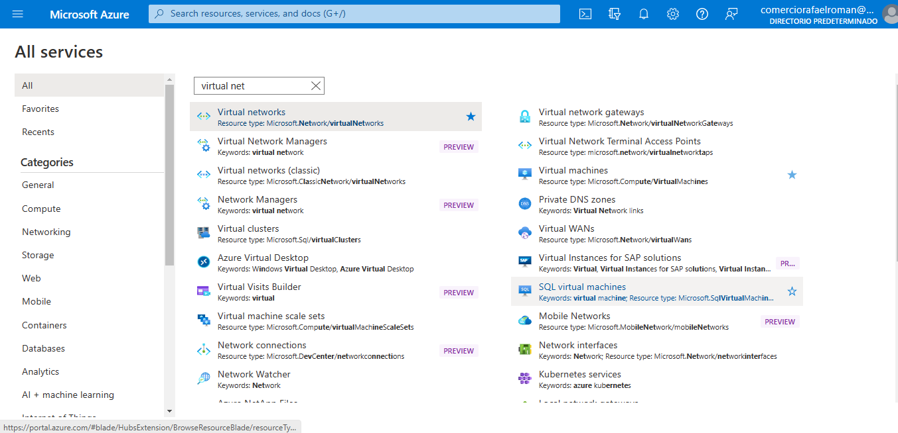

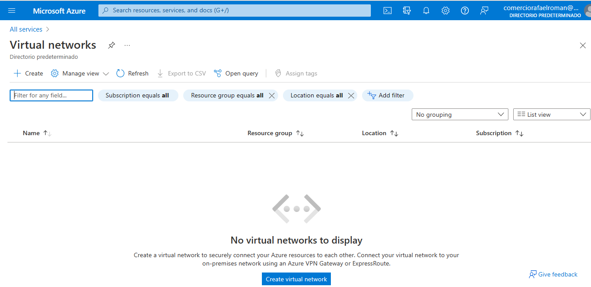

3. En la hoja **Crear red virtual** complete lo siguiente (deje los valores predeterminados para todo lo demás):

   | Configuración                | Valor                         |
   | ---------------------------- | ----------------------------- |
   | Nombre                       | **vnet1**                     |
   | Espacio de direcciones       | **10.1.0.0/16**               |
   | Suscripción                  | **Seleccione su suscripción** |
   | Grupo de recursos            | **myRGVNet** (crear nuevo)    |
   | Ubicación                    | **(EE. UU.) Este de EE. UU.** |
   | Subred - Nombre              | **predeterminado**            |
   | Rango de dirección de subred | **10.1.0.0/24**               |

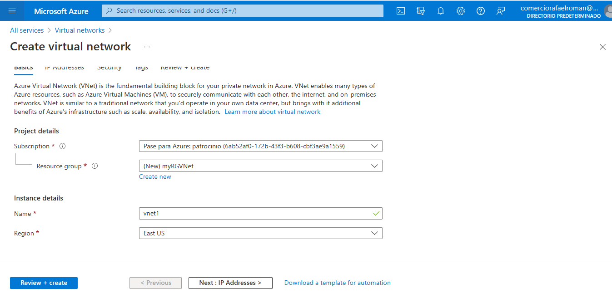

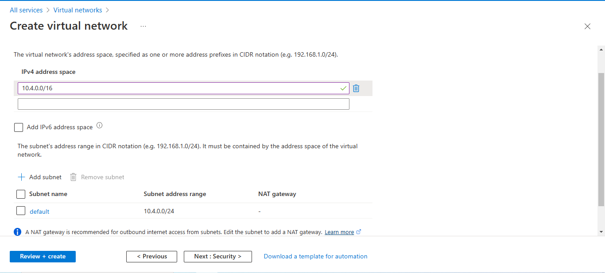

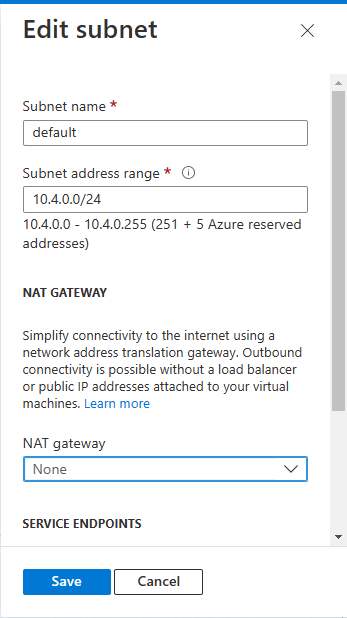

4. Haga clic en el botón **Revisar y crear**. Asegúrese de que la validación sea exitosa.

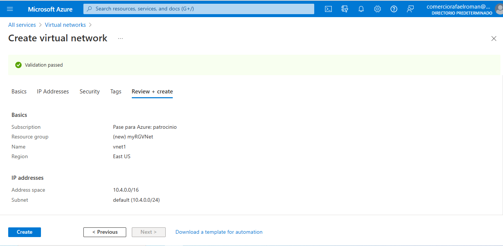

5. Haga clic en el botón **Crear** para implementar la red virtual.

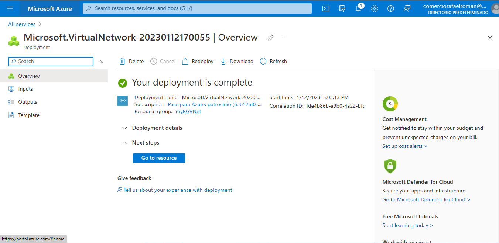

# Tarea 2: Crear dos máquinas virtuales

1. Desde la hoja **Todos los servicios**, busque **Maquinas virtuales** y luego haga clic en **Agregar**.

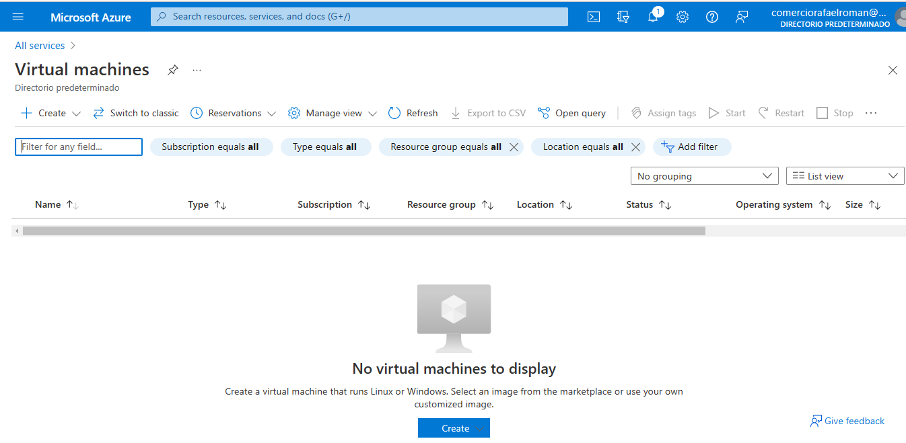

2. En la pestaña **Datos básicos**, complete la siguiente información (deje los valores predeterminados para todo lo demás):

   

   | Configuración                    | Valor                                         |
   | -------------------------------- | --------------------------------------------- |
   | Suscripción                      | **Elija su suscripción**                      |
   | Grupo de recursos                | **myRGVNet**                                  |
   | Nombre de la máquina virtual     | **vm1**                                       |
   | Región                           | **(EE. UU.) Este de EE. UU.**                 |
   | Imagen                           | **Centro de datos de Windows Server 2019**    |
   | Nombre de usuario                | **azureuser**                                 |
   | Contraseña                       | **Pa$$w0rd1234**                              |
   | Puertos de entrada públicos      | Seleccione **Permitir puertos seleccionados** |
   | Puertos de entrada seleccionados | **RDP (3389):**                               |

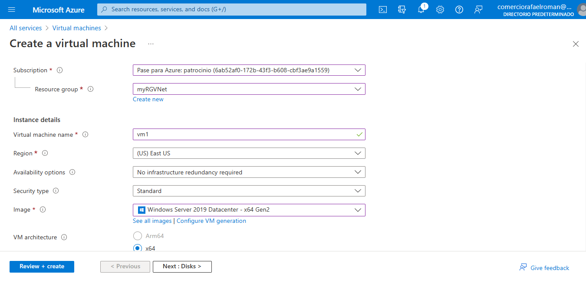

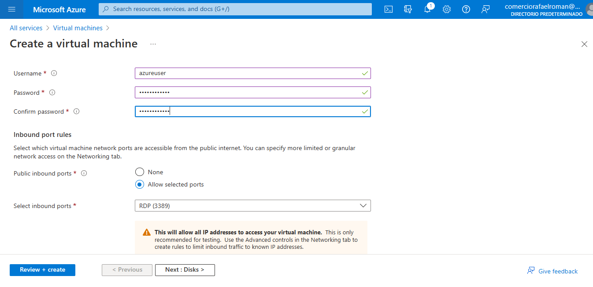

3. Seleccione la pestaña **Redes**. Asegúrese de que la máquina virtual esté ubicada en la red virtual vnet1. Revise la configuración predeterminada, pero no realice ningún otro cambio.

   | Configuración | Valor     |
   | ------------- | --------- |
   | Red virtual   | **vnet1** |

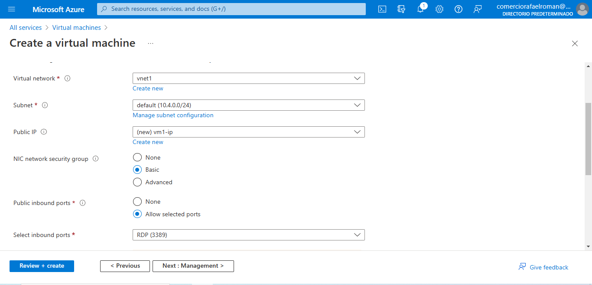

4. Haga clic en **Revisar y crear**. Después de que la validación sea exitosa, haga clic en **Crear**. Los tiempos de implementación pueden variar, pero generalmente la implementación demora entre tres y seis minutos.

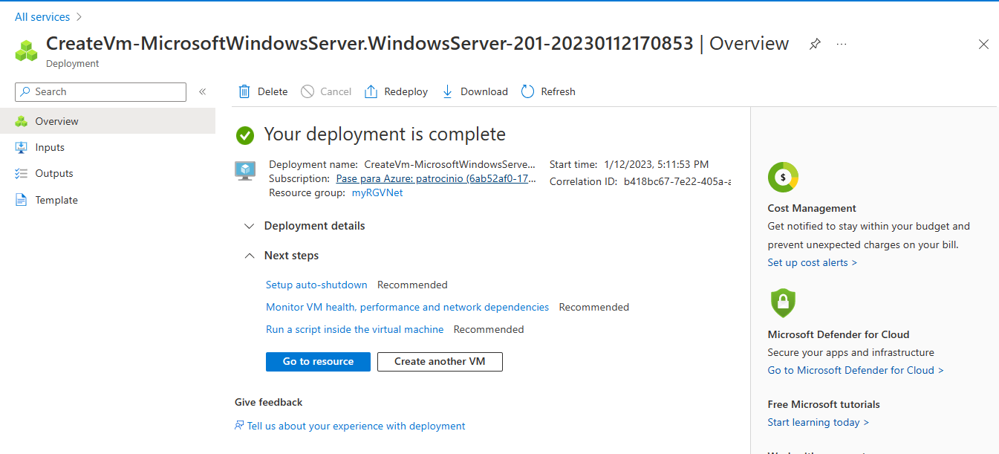

5. Supervise su implementación, pero continúe con el siguiente paso.

6. Cree una segunda máquina virtual repitiendo los pasos anteriores del **2 al 4**. Asegúrese de usar un nombre de máquina virtual diferente, que la máquina virtual esté dentro de la misma red virtual y que esté usando una nueva dirección IP pública:

   | Configuración                | Valor              |
   | ---------------------------- | ------------------ |
   | Grupo de recursos            | **myRGVNet**       |
   | Nombre de la máquina virtual | **vm2**            |
   | Red virtual                  | **vnet1**          |
   | IP pública                   | (nuevo) **vm2-ip** |

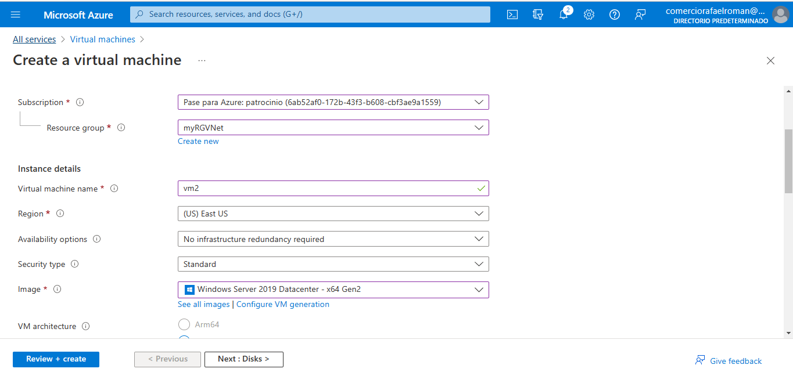


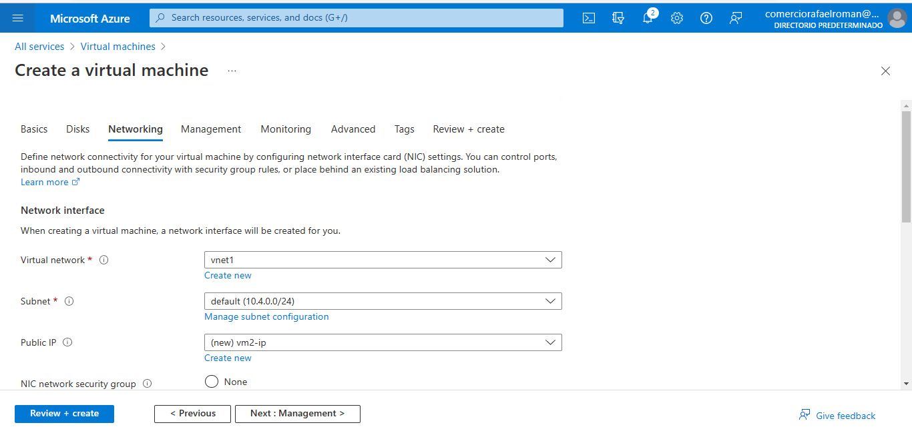

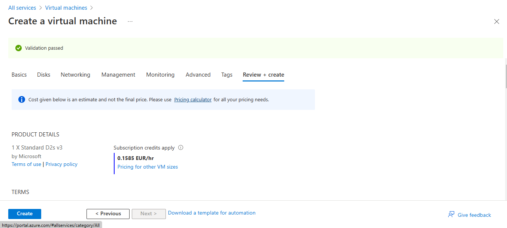

7. Espere a que se implementen ambas máquinas virtuales.

# Tarea 3: Probar la conexión

1. Desde la hoja **Todos los recursos**, busque **vm1**, abra la pestaña **Visión general** y asegúrese de que su **Estado** sea **Ejecutándose**. Es posible que necesite **Actualizar** la página.

2. En la hoja **Información general**, haga clic en el botón **Conectar**.

   **Nota**: Las siguientes instrucciones le indican cómo conectarse a su VM desde un equipo con Windows.

   

3. En la hoja **Conectar a la máquina virtual**, mantenga las opciones predeterminadas en conectarse por dirección IP a través del puerto 3389 y haga clic en **Descargar archivo RDP**.


4. Abra el archivo RDP descargado y haga clic en **Conectar** cuando se le solicite.

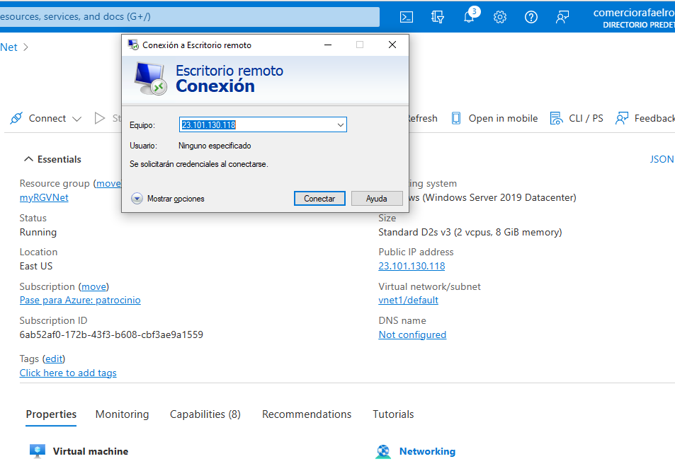

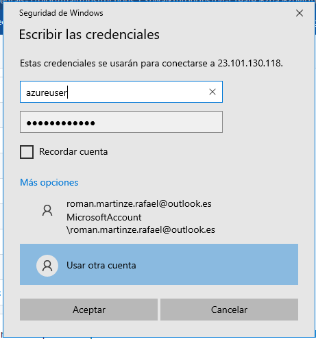

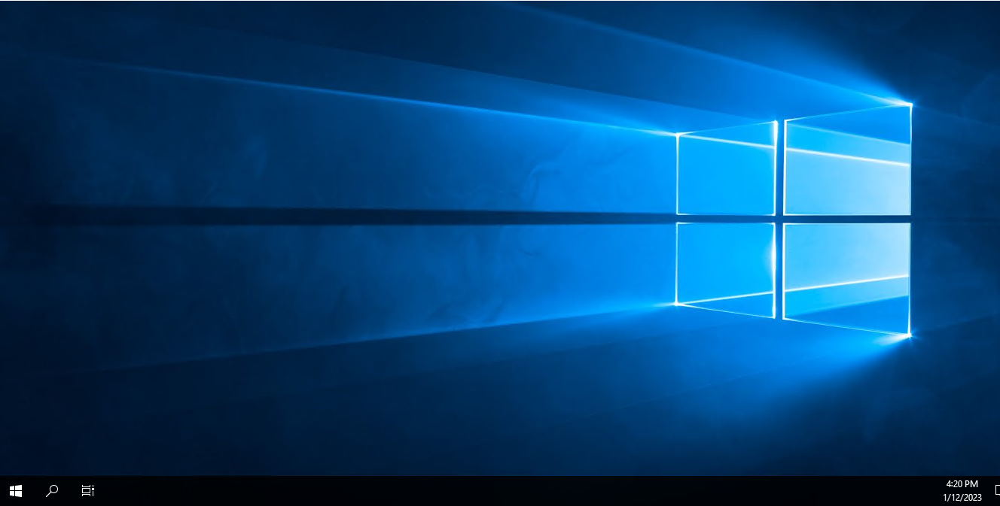

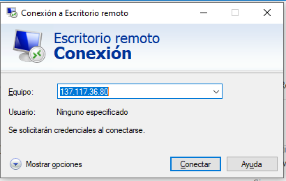

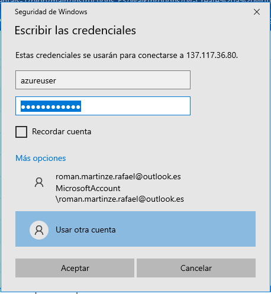

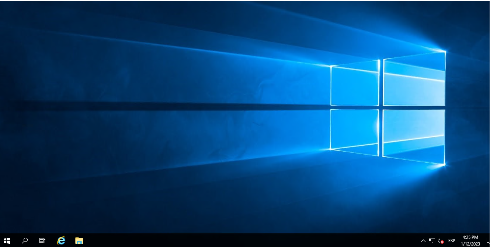

5. Abra un símbolo del sistema de PowerShell en la máquina virtual haciendo clic en el botón **Inicio**, escribiendo **PowerShell**, haciendo clic con el botón derecho en **Windows PowerShell** en el menú del botón derecho y seleccionando **Ejecutar como administrador**.

6. Intente hacer ping a vm2 (asegúrese de que vm2 se esté ejecutando). Recibirá un error que indica que la solicitud ha excedido el tiempo de espera. El `ping` falla porque usa el **Protocolo de mensajes de control de Internet (ICMP)**. De forma predeterminada, ICMP no está permitido a través del firewall de Windows.

   ```
   ping vm2
   ```

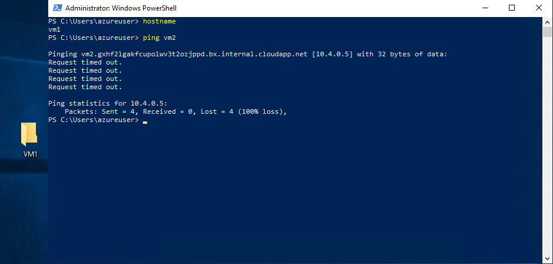

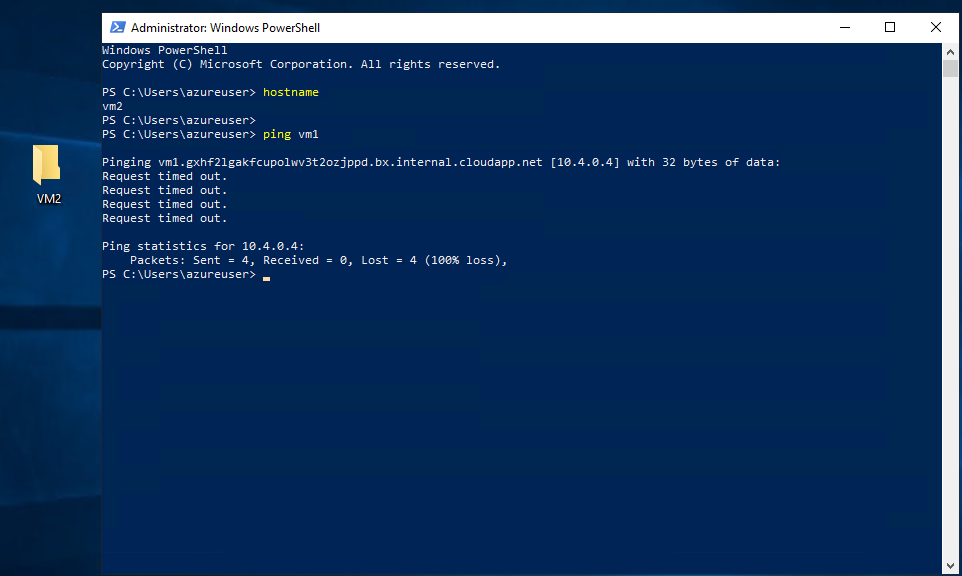

7. Abra un aviso de **PowerShell** y habilite ICMP. Este comando permite conexiones entrantes ICMP a través del firewall de Windows.

​		New-NetFirewallRule –DisplayName “Allow ICMPv4-In” –Protocol ICMPv4

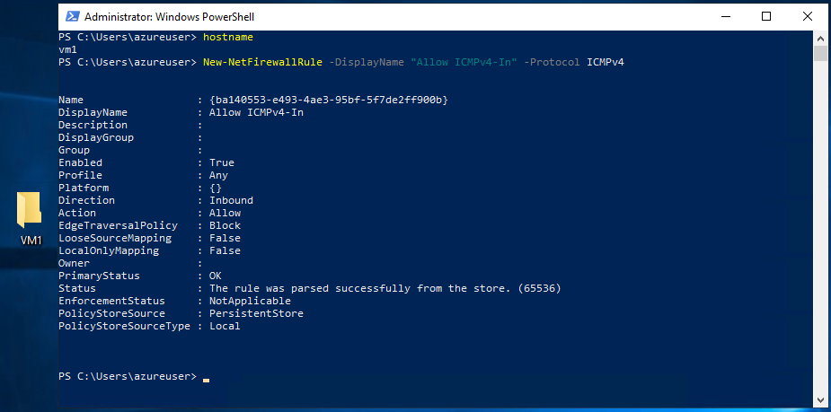

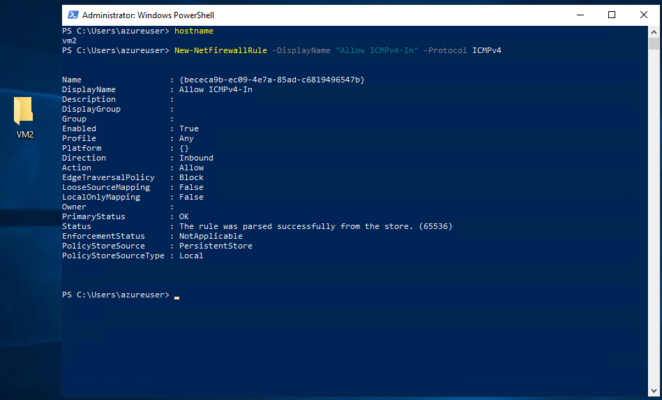

8. Regrese a la sesión RDP a vm1 e intente hacer ping nuevamente. Ahora debería tener éxito.

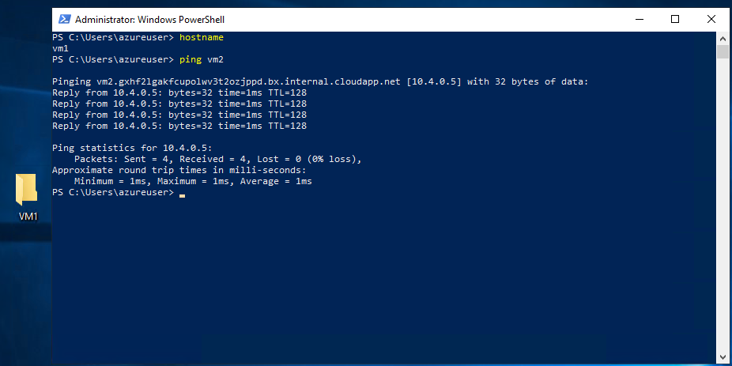

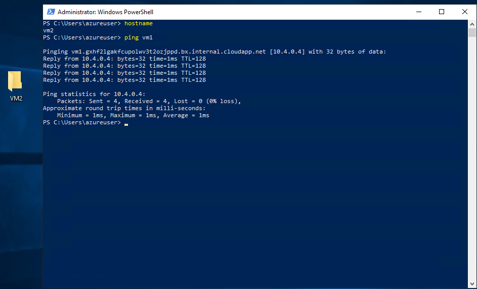

¡Enhorabuena! Ha configurado dos máquinas virtuales y las ha implementado en una red virtual. También ha configurado el firewall de Windows para que una de las máquinas virtuales permita las solicitudes de ping entrantes.